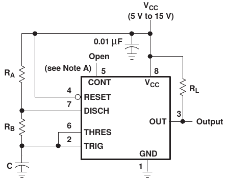

# How to assembly an apparatus to monitor soil salinity

This tutorial describes the steps to assembly the **Sprob** sensor using basics components found in any electroncs shops. We use the [Arduino](https://www.arduino.cc/) open source and hardware platform. The sensor uses the principle of soil resistivity as a component of resonator circuit that output a quadratic wave with frequency dependant of that resistance. The methodology for analysis and  calibrations of this sensor are in paper que this tutorias is part.

## 1. IC NE555

### 1.1 Brief description

The [NE555 of Texas Instruments](https://www.ti.com/product/NE555) is an IC with widely utilization in electronics systems for resonator objective. The IC has operations mode that depend on the associated circuit. We utilize the [A-Stable](https://www.ti.com/document-viewer/NE555/datasheet/detailed_description#SLFS0227709) mode.


*Figure 1. A-Stable mode of IC NE555. Figure from IC NE555 [datasheet](https://www.ti.com/product/NE555) from Texas Instruments.*

The **C** capacitor charge through **R<sub>A</sub>** and **R<sub>B</sub>** resistors and discharge through the **R<sub>B</sub>** resistor, resulting in quadratic wave in pin **OUT**. The frequency of this wave depends on the time of charge and discharge of **C** capacitor. As charge of the **C** capacitor is dependant of the resistors, the resistance variations of this resistors results in different time of charge and discharge of **C** capacitor. With this, we can change the resistor **R<sub>B</sub>** for two probes, as describe in section 2.

### 1.2. Components

Components for the A-Stable circuit with the IC NE555:

- 1 x CI NE555 Texas Instruments;
- 1 x Resistor 1KΩ;
- 1 x Ceramic capacitor 10nF;
- 1 x Ceramic capacitor 2µF.

The completed circuit is in Figure 4.

### 1.3. Where to buy

- Brazil:
  - [Baú da Eletrônica](https://www.baudaeletronica.com.br);
  - [Curto Circuito](https://www.curtocircuito.com.br/);
  - [Multi Comercial](https://www.multcomercial.com.br).
- USA and Europe:
  - [Mouser](https://www.mouser.com);
  - [Farnell](https://www.farnell.com).

## 2. Probes

### 2.1 Brief description

The probes principle is the resistivity of a aqueous salinity solution to conduct electricity. When the probes is under potential difference, the solution ionic concentration result in a resistance for current through the probes.

### 2.2. Materials

Materials for problems assembly:

- 20 cm of 3/4 PVC tube;
- 2 x cap for 3/4 PVC tube;
- 2 x bolt of 7 cm;
- 2 x nuts;
- Wires.

Fix the bolts in PVC tube cap for works as sensor probe. Fix the wire in each bolt for connect to system (Figure 5).


*Figura 2. Details of **SProb** probe connections.*

Connect the the cap in PVC tube as in Figure 3.


*Figura 3. Complete **SProb** probe.*

## 3. Arduino

### 3.1. Breve descrição

The [Arduino](https://www.arduino.cc/) is an open source and code platform. The microcontroller in several Arduino's board can control a variety of electronics peripherals. in oficial site there are many tutorial of Arduino utilization. The are a several tutorial in internet for solutions using Arduino.

We utilize the [Arduino UNO](https://store.arduino.cc/usa/arduino-uno-rev3) to read frequency from IC NE555 output. After read, the software (section 4) process the data and output it to a LCD display connected in Arduino UNO.


*Figure 4. Schematic for sensor, Arduino e LCD connection. Schematic using [Fritzing](https://fritzing.org).*

### 3.2. Components

Components for Arduino and LCD display connections:

- 1 x Arduino UNO Rev3;
- 1 x 16x2 LCD Display LCD 16x2 (16 characters and 2 rows);
- 1 x Resistor 220Ω;

### 3.3. Where to buy

- Brazil:
  - [Baú da Eletrônica](https://www.baudaeletronica.com.br);
  - [Curto Circuito](https://www.curtocircuito.com.br/).
- EUA e Europa:
  - [Arduino Store](https://store.arduino.cc).

## 4. Code

The code is uploaded to Aruino UNO microcontroller using Arduino platform. The code read process the IC NE555 output and output the result in LCD display. The code can be downloaded in [this link](.source/555frequency.ino) too.

```c
/*
 * Created by
 * Mauro Brum
 * Date: 27/12/2018
 * Function: scritp for the salinity sensor aparato
 */


/*
 * --------------------------- Libraries ---------------------------------------
 */
#include <LiquidCrystal.h>

/*
 * --------------------------- Global Variables --------------------------------
 */


// define some variable to account the pulse signel from 555
int Htime = 0;              //integer for storing higher pulso in the frequency
int Ltime = 0;              //integer for storing lower pulse in the frequency
float Ttime = 0.0F;         //integer for storing total time of a cycle
float frequency = 0.0F;     //float for storing frequency
float freq_average = 0.0F;  //float for storing average frequency

#define NUMSAMPLES 10

int samples[NUMSAMPLES] = {0};
int current_sample = 0;


/*
 * --------------------------- Start objects -----------------------------------
 */
// select the pins used on the LCD panel
// LiquidCrystal (rs, en, d4, d5, d6, d7);
LiquidCrystal lcd(8,  9,  4,  5,  6,  7);


/*
 * --------------------------- Setup -------------------------------------------
 */

void setup()
{
  // set the pin mode 1 to receive the signal from 555
  pinMode(2,INPUT);
  // start LCD the library
  lcd.begin(16, 2);
  // clear lcd
  lcd.clear();
}

/*
 * --------------------------- Loop --------------------------------------------
 */
void loop()
{
  // Read 555 pulse
  Htime = pulseIn(2, HIGH); // microseconds from high to low
  Ltime = pulseIn(2, LOW);  // microseconds from low to high
  Ttime = Htime + Ltime;  // total time
  frequency = 1000000.0F / Ttime;

  if(current_sample < NUMSAMPLES)
  {
    samples[current_sample] = frequency;  // save read frequency
    current_sample++;            // update index
  }
  else
  {
    current_sample = 0;      // update index

    // avarage of samples
    for(int i = 0; i < NUMSAMPLES; i++)
    {
      freq_average += samples[i];  
    }

    freq_average /= NUMSAMPLES;
  }

  lcd.setCursor(0,0);        // move cursor to position 0, line 0
  lcd.print("Frequency (Hz)");
  lcd.setCursor(0,1);        // move cursor to position 0, line 1
  lcd.print(freq_average);

}

```

## 5 Complete project

Complete schematic of probe and IC NE555 to Arduino UNO and LCD display:


*Figure 5. Complete __Sprob__ sensor. Schematic with [Fritzing](https://fritzing.org).*

Complete components list:

- 1 x IC NE555 Texas Instruments;
- 1 x Resistor 1KΩ;
- 1 x Ceramic capacitor 10nF;
- 1 x Ceramic capacitor 2µF;
- 20 cm 3/4 PVC tube;
- 2 x 3/4 PVC tube cap;
- 2 x bolt of 7 cm;
- 2 x nuts;
- Wires;
- 1 x Arduino UNO Rev3;
- 1 x 16x2 LCD Display LCD (16 characters and 2 rows);
- 1 x Resistor 220Ω.
