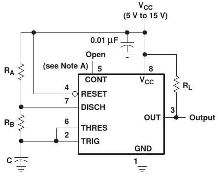
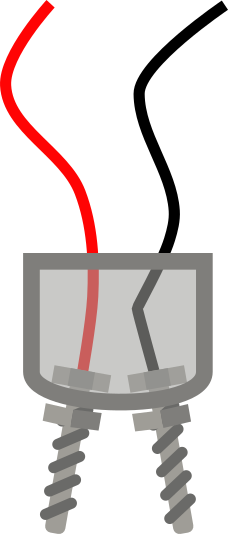
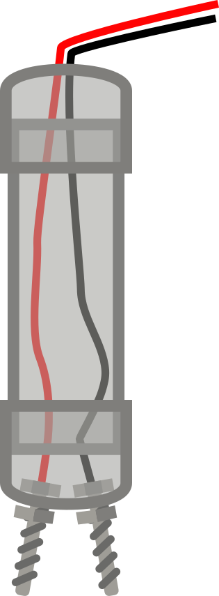
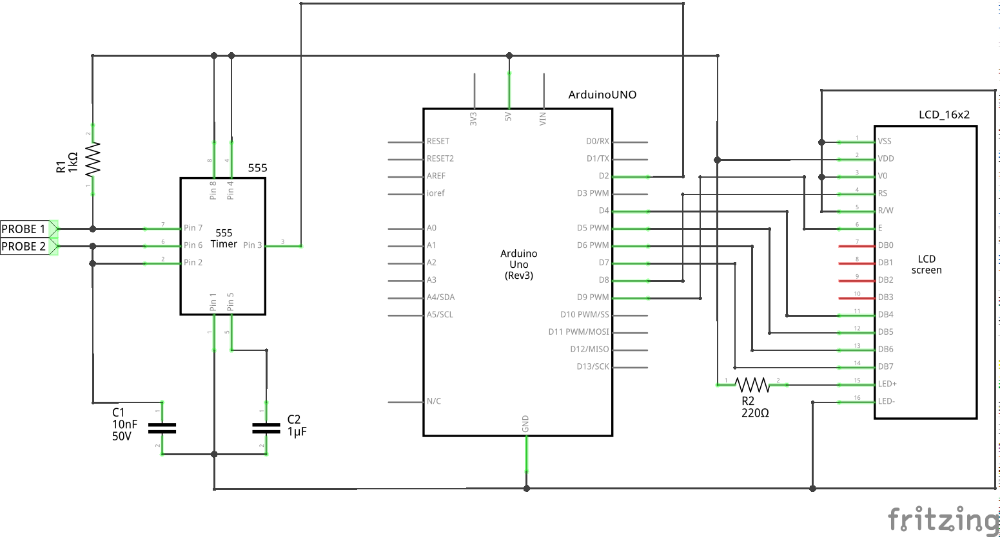
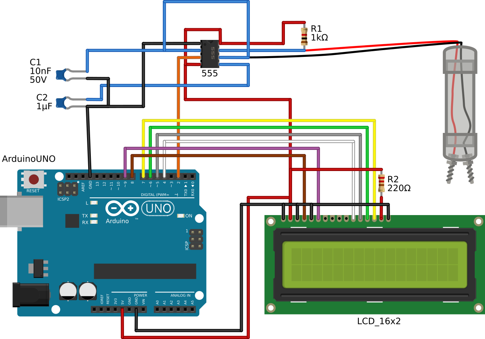

# Como montar um sensor para monitorar a salinidade do solo

Nete tutorial, descreveremos os passos para a montagem do sensor **Sprob** usando componentes básicos encontrados em qualquer loja de eletrônica. Utilizaremos a plataforma open source e hardware [Arduino](https://www.arduino.cc/). O princípio do sensor é usar a resistividade do solo como um componente de um circuito eletrônico oscilador que gera uma onda com frequência dependente dessa resistência. A metodologia para calibração e análise dos dados estão no artigo que contempla este tutorial.

## 1. CI NE555

### 1.1 Breve descrição

O [NE555 da Texas Instruments](https://www.ti.com/product/NE555) é um CI com ampla utilização em sistemas eletrônicos para criar temporizadores. O CI apresenta alguns modos de operação que dependem do circuito eletrônico associado so CI. Dentre estes modos de operações, utilizaremos o modo [A-Stable](https://www.ti.com/document-viewer/NE555/datasheet/detailed_description#SLFS0227709) em que o CI opera como um oscilador.


*Figura 1. Modo A-Stable do CI NE555. Imagem retirada do [datasheet](https://www.ti.com/product/NE555) do CI NE555 da Texas Instruments.*

O capacitor **C** é carregado através dos resistores **R<sub>A</sub>** e **R<sub>B</sub>** e descarregado através do resistor **R<sub>B</sub>**, gerando uma onda quadrática no pino **OUT**. A frequência dessa onda é dependente da velocidade com que o capacitor **C** é carregado e descarregado. Como o carregamento de **C** é dependente dos resistores, a variação da resistência desses resistores resulta em diferentes tempos de carregamento e descarregamento de **C**. Desse modo, podemos substituir o resistor **R<sub>B</sub>** por duas pontas de prova descrita na seção 2.

### 1.2. Componentes associados

Componentes para o circuito A-Stable com o CI NE555:

- 1 x CI NE555 Texas Instruments;
- 1 x Resistor 1KΩ;
- 1 x Capacitor cerâmico 10nF;
- 1 x Capacitor cerâmico 2µF.

O circuito completo está no esquema da Figura 4.

### 1.3. Onde comprar

- Brasil:
  - [Baú da Eletrônica](https://www.baudaeletronica.com.br);
  - [Curto Circuito](https://www.curtocircuito.com.br/);
  - [Multi Comercial](https://www.multcomercial.com.br).
- EUA e Europa:
  - [Mouser](https://www.mouser.com);
  - [Farnell](https://www.farnell.com).

## 2. Pontas de prova

### 2.1 Breve descrição

O princípio para a montage das pontas de prova é baseada na capacidade de um meio aquoso de conduzir eletricidade. Quando as duas pontas de prova estão sob um diferencial de potencial, a quantidade de íons do meio oferece uma resistência para corrente fluir entre as pontas de prova.

### 2.2. Materiais

Materiais para montagem da ponta de prova:

- 20 cm de tubo PVC 3/4;
- 2 x tampa para tubo PVC 3/4;
- 2 x parafusos de 7 cm;
- 2 x porcas;
- Fio.

Fixe os dois parafusos em uma das tampas do tubo PVC para funcionar como as pontas de prova do sensor. Fixe o fio em cada uma das pontas para ligá-los ao sistema posteriormente (Figura 5).


*Figura 2. Detalhe da ligação da ponta de prova do __SProb__.*

Conecte a ponta de prova com os parafusos no tubo PVC como na Figura 3.


*Figura 3. Ponta de prova completa do __SProb__.*

## 3. Arduino

### 3.1. Breve descrição

O [Arduino](https://www.arduino.cc/) é uma plataforma de código e hardware aberto. O microcontrolador dos diversos modelos de placas da plataforma permite controlar uma variedade de periféricos eletrônicos. No site oficial da plataforma há diversos tutoriais de como utilizar o Arduino. Há também diversos tutoriais na internet de como montar uma variedade de soluções com o Arduino.

Nós utilizamos o [Arduino UNO](https://store.arduino.cc/usa/arduino-uno-rev3) para ler a frequência do sinal na saída do IC NE555. Após a leitura, o programa (seção 4) processa os dados e mostra em um display LCD conectado ao Arduino UNO.


*Figura 4. Esquema do sistema com o sensor, Arduino e LCD. Esquema montado no software [Fritzing](https://fritzing.org).*

### 3.2. Componentes

Componentes para a montagem do Arduino UNO com o display LCD:

- 1 x Arduino UNO Rev3;
- 1 x Display LCD 16x2 (16 caracteres e 2 linhas);
- 1 x Resistor 220Ω;

### 3.3. Onde comprar

- Brasil:
  - [Baú da Eletrônica](https://www.baudaeletronica.com.br);
  - [Curto Circuito](https://www.curtocircuito.com.br/).
- EUA e Europa:
  - [Arduino Store](https://store.arduino.cc).

## 4. Código

Código para gravação no microcontrolador do Arduino UNO usando a plataforma do Arduino. O código lê e processe o sinal de saída do IC NE555 e mostra o resultado no display LCD. O código também está disponível [neste link](.source/555frequency.ino).

```c
/*
 * Created by
 * Mauro Brum
 * Date: 27/12/2018
 * Function: scritp for the salinity sensor aparato
 */


/*
 * --------------------------- Libraries ---------------------------------------
 */
#include <LiquidCrystal.h>

/*
 * --------------------------- Global Variables --------------------------------
 */


// define some variable to account the pulse signel from 555
int Htime = 0;              //integer for storing higher pulso in the frequency
int Ltime = 0;              //integer for storing lower pulse in the frequency
float Ttime = 0.0F;         //integer for storing total time of a cycle
float frequency = 0.0F;     //float for storing frequency
float freq_average = 0.0F;  //float for storing average frequency

#define NUMSAMPLES 10

int samples[NUMSAMPLES] = {0};
int current_sample = 0;


/*
 * --------------------------- Start objects -----------------------------------
 */
// select the pins used on the LCD panel
// LiquidCrystal (rs, en, d4, d5, d6, d7);
LiquidCrystal lcd(8,  9,  4,  5,  6,  7);


/*
 * --------------------------- Setup -------------------------------------------
 */

void setup()
{
  // set the pin mode 1 to receive the signal from 555
  pinMode(2,INPUT);
  // start LCD the library
  lcd.begin(16, 2);
  // clear lcd
  lcd.clear();
}

/*
 * --------------------------- Loop --------------------------------------------
 */
void loop()
{
  // Read 555 pulse
  Htime = pulseIn(2, HIGH); // microseconds from high to low
  Ltime = pulseIn(2, LOW);  // microseconds from low to high
  Ttime = Htime + Ltime;  // total time
  frequency = 1000000.0F / Ttime;

  if(current_sample < NUMSAMPLES)
  {
    samples[current_sample] = frequency;  // save read frequency
    current_sample++;            // update index
  }
  else
  {
    current_sample = 0;      // update index

    // avarage of samples
    for(int i = 0; i < NUMSAMPLES; i++)
    {
      freq_average += samples[i];  
    }

    freq_average /= NUMSAMPLES;
  }

  lcd.setCursor(0,0);        // move cursor to position 0, line 0
  lcd.print("Frequency (Hz)");
  lcd.setCursor(0,1);        // move cursor to position 0, line 1
  lcd.print(freq_average);

}

```

## 5 Projeto completo

Esquema completo de ligação da ponta de prova ao circuito NE555, Arduino e display LCD:


*Figura 5. Montagem completa do sensor Sprob. Esquema montado no software [Fritzing](https://fritzing.org).*

Lista completa de componentes utilizados:

- 1 x CI NE555 Texas Instruments;
- 1 x Resistor 1KΩ;
- 1 x Capacitor cerâmico 10nF;
- 1 x Capacitor cerâmico 2µF;
- 20 cm de tubo PVC 3/4;
- 2 x tampa para tubo PVC 3/4;
- 2 x parafusos de 7 cm;
- 2 x arruelas;
- Fios;
- 1 x Arduino UNO Rev3;
- 1 x Display LCD 16x2 (16 caracteres e 2 linhas);
- 1 x Resistor 220Ω.
